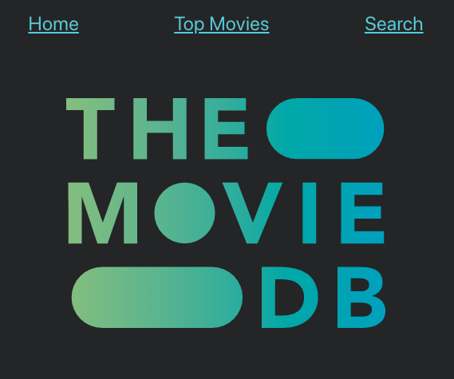
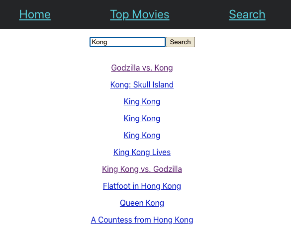
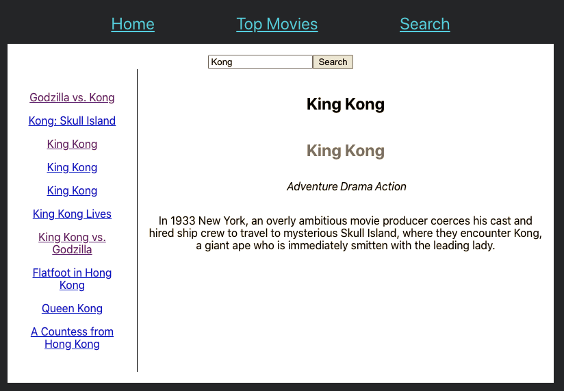

# MOVIE API CLIENT

> Disponible en [Castellano](./README.es.md)

This project is a client for [The Movie DB](https://https://www.themoviedb.org/) developed using [react](https://reactjs.org/) as a final project for geekshubsacademy react bootcamp.

## Requirements
To build and run this project you must have available:
- Nodejs (version 16.0 or above)
- A valid api key for The Movie DB (can be requested [here](https://www.themoviedb.org/settings/api) )

## Installation
After cloning this repository you must run `npm install` to download all local nodejs dependencies.

You also should provide the api key to your env. The easiest and safest way is to write it in an `.env` file. Copy the `.env.example` file as `.env` and fullfill its fields:
```
REACT_APP_API_KEY=_YOUR_THE_MOVIE_DB_API_KEY_
```

## Available Scripts

In the project directory, you can run:

### `npm start`

Runs the app in the development mode.\
Open [http://localhost:3000](http://localhost:3000) to view it in your browser.

The page will reload when you make changes.\
You may also see any lint errors in the console.

### `npm test`

Launches the test runner in the interactive watch mode.\
See the section about [running tests](https://facebook.github.io/create-react-app/docs/running-tests) for more information.

### `npm run build`

Builds the app for production to the `build` folder.\
It correctly bundles React in production mode and optimizes the build for the best performance.

The build is minified and the filenames include the hashes.\
Your app is ready to be deployed!

See the section about [deployment](https://facebook.github.io/create-react-app/docs/deployment) for more information.

## Screenshots



